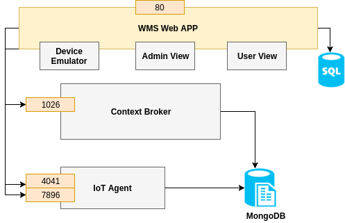

# wms
Workspace Management System using FIWARE

## Basic Architecture



## Installation Requirments

```
   sudo apt-get install python-dev python-pip
   sudo pip install django==1.8.2
   sudo pip install djangorestframework
   sudo pip install markdown
   sudo pip install django-filter
   sudo apt-get install git

```

## Configure settings

```
   git clone https://github.com/aabdulwahed/wms.git
   cd wms/
   vi wms/settings.py
```
- configure the following lines

```
   fiware_IP = <FIWARE IP ADDRESS>
   cbroker='http://%s:1026'%(fiware_IP)
   entity_type="thing"
   resouce="/iot/d"
   protocol="PDI-IoTA-UltraLight"
   timezone="Europe/Madrid"
   service_api = "http://%s:4041/iot/services"%(fiware_IP)
   workspace_api="http://%s:4041/iot/devices"%(fiware_IP)
   device_api="http://%s:7896/iot/d"%(fiware_IP)
   ngsi_api = "http://%s:1026/ngsi10/queryContext"%(fiware_IP)

```

## Start server
```
   sudo python manage.py runserver 0.0.0.0:80

```

